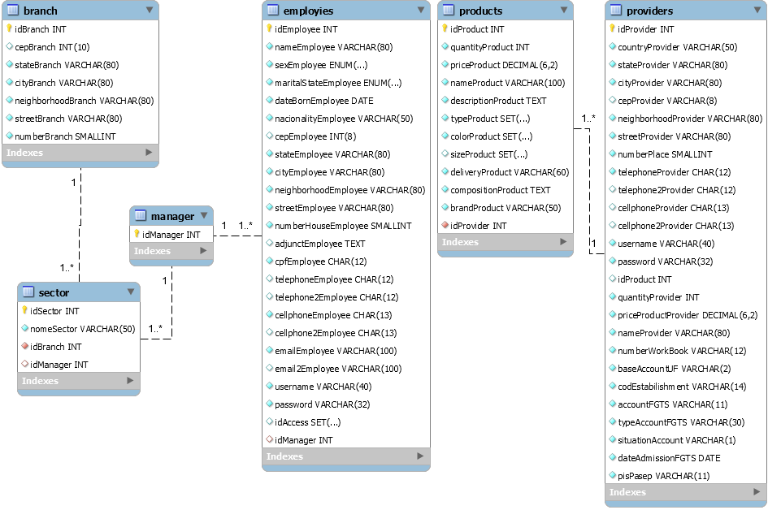
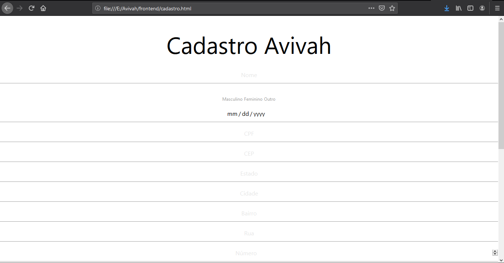

# Avivah System

>Este projeto é um sistema de uma loja de enxovais que está sendo desenvolvida durante a aula de banco de dados na escola técnica [Etec Antônio Devisate](http://devisate.com.br/), as quais são lecionadas pelo professor [Arnaldo Martins Hidalgo Júnior](https://hidalgojunior.com.br/).

Inicialmente o projeto tinha como principal objetivo o desenvolvimento de um banco de dados contendo todas tabelas necessárias para uma loja de enxovais, tais quais fornecedores, funcionarios, filiais, etc.

Porém, através de uma brincadeira que nosso professor fez, dizendo que ele queria que nós desenvolvessemos um sistema que pudesse acessar o banco de dados através da web;De primeira, acreditamos em que ele disse e nos desesperamos pensando na forma de como poderiamos fazer tal conexão, como resultado disso, partimos para o estudo e resolvemos então usar a linguagem PHP para efetuar tal tarefa.

#### A seguir, está o diagrama de entidade e relacionamento

#### Hoje, o nosso projeto ainda está em fase de construção e apresenta um sistema que funciona da seguinte maneira:

1. Pagina de login *(index.html)* recebe o nome de usuário e a senha;
2. Os dados são enviados para a autenticação *(auth.php)*;
3. Ainda na tela de login se o usuário não for registrado, ele pode clicar em cadastrar-se;
4. Página de cadastro *(cadastro.html)* recebe os dados do cliente;
5. Os dados são enviados para a gravação de registro e validação de existência *(register.php)* e após são gravados no banco de dados;
6. O usuário tem seus dados cadastrados e é redirecionado para a tela de login para efetuar o login *(volta para o tópico 1)*.

## Abaixo seguem algumas fotos da interface do sistema.
#### Tela de login

#### Tela de cadastro

## Esta é a versao 0.1 do nosso sistema, deixe sua estrela neste repositório para nos deixar cada vez mais motivados *"Viva a dopamina!!"* 

|Composição do grupo|Emails|
|-----------|-----------|
|[Adrian Jaquier](https://github.com/adrian2004)|adrian.jaquier@etec.sp.gov.br|
|[Gabriel Ragonha](https://github.com/GabrielRagonhaRodrigues)|gabriel.rodrigues313@etec.sp.gov.br|
|[Joaby Oliveira](https://github.com/joaby-oliveira)|joaby.santos@etec.sp.gov.br|
|[Nicolas Florencio](https://github.com/nikitofloren)|nicolas.alves14@etec.sp.gov.br|
